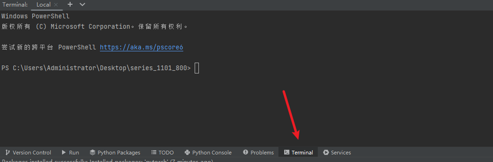
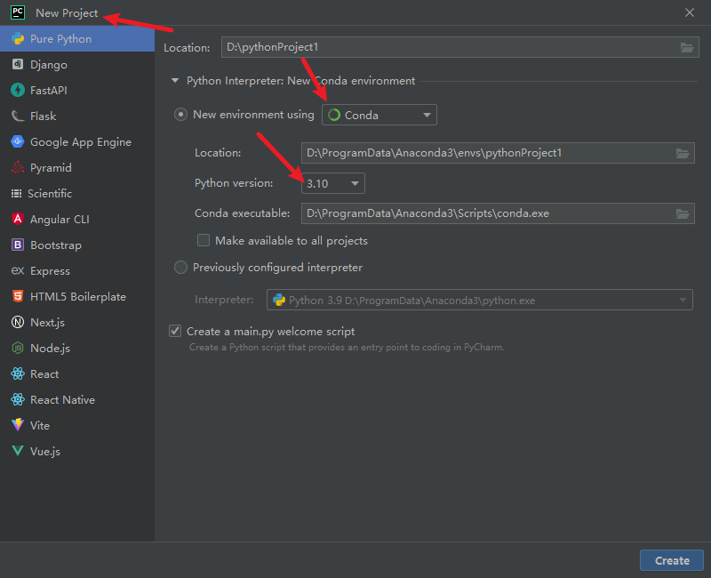
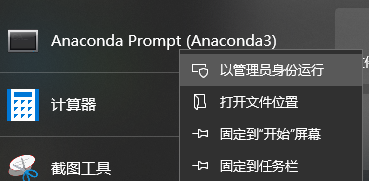
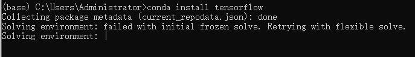

[PyCharm下载](https://www.jetbrains.com/pycharm/)

打开命令行



[Anaconda 下载](https://www.anaconda.com/products/distribution/start-coding-immediately)

pycharm用Anaconda可以在每个工程创建的时候选择python的版本从而不影响其他项目的环境



conda安装到PYcharm[教程](https://blog.csdn.net/qq_44955003/article/details/120385651)

基础环境中没有tensorflow





```
conda install tensorflow 
```

一直出现错误Solving environment: failed with initial frozen solve. Retrying with flexible solve.

```
pip install tensorflow  -i  http://mirrors.aliyun.com/pypi/simple/ --trusted-host mirrors.aliyun.com
```

